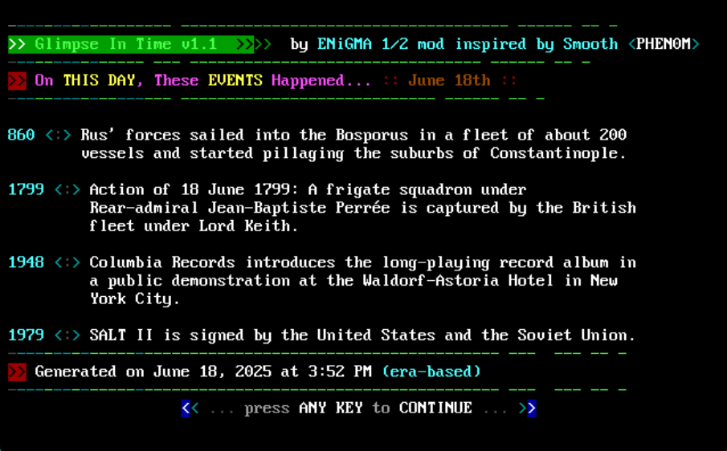

# Day in History - ENiGMA½ Module

A feature-rich ENiGMA½ BBS module that displays historical events that occurred on the current day, with multiple variety strategies for event selection.



## Features

- **Multiple Selection Strategies**: Era-based, oldest-first, source-balanced, and random event selection
- **Smart Display Logic**: Dynamically fits events based on available screen space
- **Word Wrapping**: Intelligent text wrapping with proper alignment
- **Animated Loading**: Retro-style progress bars during data fetch
- **Real-time Data**: Fetches current historical events from Wikimedia API
- **Strategy Display**: Shows which selection strategy was used in the footer
- **Classic BBS Styling**: Authentic retro terminal aesthetics

## Installation

### 1. Create Module Directory
```bash
mkdir -p /path/to/enigma-bbs/mods/ja_day_in_history
```

### 2. Install Module File
Save the module as:
```
/path/to/enigma-bbs/mods/ja_day_in_history/ja_day_in_history.js
```

### 3. Add Menu Entries
Add these entries to your `menu.hjson` file:

```hjson
{
  "menus": {
    // Your existing menus...
    
    "dayInHistoryEra": {
      "desc": "Day in History - Era Based",
      "module": "@userModule:ja_day_in_history"
    },
    "dayInHistoryOldest": {
      "desc": "Day in History - Ancient Focus",
      "module": "@userModule:ja_day_in_history"
    },
    "dayInHistoryBalanced": {
      "desc": "Day in History - Source Balanced",
      "module": "@userModule:ja_day_in_history"
    },
    "dayInHistoryRandom": {
      "desc": "Day in History - Random",
      "module": "@userModule:ja_day_in_history"
    }
  }
}
```

### 4. Add Door Menu Commands
In your doors menu or main menu, add command mappings:

```hjson
"submit": [
  {
    "value": {
      "command": "D"
    },
    "action": "@menu:dayInHistoryEra"
  },
  {
    "value": {
      "command": "D1"
    },
    "action": "@menu:dayInHistoryOldest"
  },
  {
    "value": {
      "command": "D2"
    },
    "action": "@menu:dayInHistoryBalanced"
  },
  {
    "value": {
      "command": "D3"
    },
    "action": "@menu:dayInHistoryRandom"
  }
]
```

### 5. Restart ENiGMA½
```bash
# Stop ENiGMA½
# Start ENiGMA½
```

## Usage

Users can access different strategies via door commands:

- **`D`** - Era-based selection (balanced across historical periods)
- **`D1`** - Oldest-first (focuses on ancient history)
- **`D2`** - Source-balanced (balanced across different types of events)
- **`D3`** - Random selection

## Selection Strategies

### Era-Based (Default)
Selects events distributed across different historical eras:
- **Ancient** (1-500 AD): 1 event
- **Medieval** (501-1500): 1 event  
- **Early Modern** (1501-1800): 1 event
- **Modern** (1801-1950): 1 event
- **Contemporary** (1951-2030): 1 event

### Oldest-First
Prioritizes the most ancient historical events available for the current day.

### Source-Balanced
Attempts to balance events across different types and sources for variety.

### Random
Randomly selects events from all available options for the current day.

## Technical Details

### API Integration
- Uses Wikimedia's "On This Day" API
- Fetches real-time historical data
- Handles API failures gracefully
- 10-second timeout protection

### Display Features
- **Dynamic Event Fitting**: Calculates available screen space and fits maximum events
- **Word Wrapping**: Intelligent text wrapping with proper indentation
- **Year Alignment**: Consistent 4-digit year padding for clean alignment
- **Screen Layout**: Fixed header (rows 1-7), dynamic content (rows 8-19), footer (rows 20-22), pause (row 24