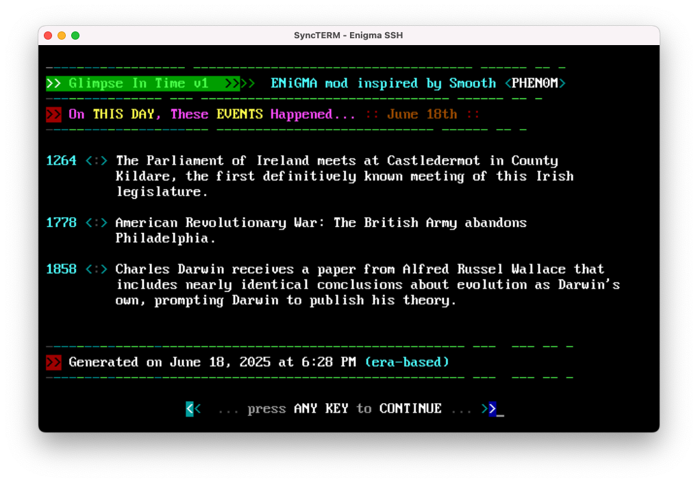

[](LICENSE)
[](https://github.com/NuSkooler/enigma-bbs)

# Day in History - ENiGMA½ Module


A feature-rich ENiGMA½ BBS module that displays historical events that occurred on the current day, with multiple variety strategies for event selection. The inspiration, and design, comes from Smooth of PHEN0M, who originally created this as a Mystic BBS mod. I've re-worked this concept as an ENiGMA½ Module, adapting the data source to Wikimedia's API.

## Features

- **Multiple Selection Strategies**: Era-based, oldest-first, source-balanced, and random event selection
- **Smart Display Logic**: Dynamically fits events based on available screen space
- **Word Wrapping**: Intelligent text wrapping with proper alignment
- **Animated Loading**: Animated progress bars during data fetch
- **Real-time Data**: Fetches current historical events from Wikimedia API
- **Strategy Display**: Shows which selection strategy was used in the footer
- **Classic BBS Styling**: Authentic retro terminal aesthetics

## Installation

### 1. Create Module Directory
```bash
mkdir -p /path/to/enigma-bbs/mods/ja_day_in_history
```

### 2. Install Module File
Save the module as:
```
/path/to/enigma-bbs/mods/ja_day_in_history/ja_day_in_history.js
```

### 3. Add Menu Entries
Add these entries to the `[menuName].hjson` file of your choice (you can use one of the pre-configured strategies):

```hjson
{
  "menus": {
    // Your existing menus...
    
    "dayInHistoryEra": {
      "desc": "Day in History - Era Based",
      "module": "@userModule:ja_day_in_history"
    },
    "dayInHistoryOldest": {
      "desc": "Day in History - Ancient Focus",
      "module": "@userModule:ja_day_in_history"
    },
    "dayInHistoryBalanced": {
      "desc": "Day in History - Source Balanced",
      "module": "@userModule:ja_day_in_history"
    },
    "dayInHistoryRandom": {
      "desc": "Day in History - Random",
      "module": "@userModule:ja_day_in_history"
    }
  }
}
```

### 4. Add Menu Commands
In your menu, add command mappings to match any Menu Entries used:

```hjson
"dayInHistoryEra": {
  "desc": "Day in History - Era Based",
  "module": "@userModule:ja_day_in_history",
  "extraArgs": {
    "varietyStrategy": "era-based",
    "minYear": 1,
    "excludeBirthsDeaths": true,
    "eras": [
      {
        "name": "Ancient",
        "min": 1,
        "max": 500,
        "quota": 1
      },
      {
        "name": "Medieval",
        "min": 501,
        "max": 1500,
        "quota": 1
      },
      {
        "name": "Early Modern",
        "min": 1501,
        "max": 1800,
        "quota": 1
      },
      {
        "name": "Modern",
        "min": 1801,
        "max": 1950,
        "quota": 1
      },
      {
        "name": "Contemporary",
        "min": 1951,
        "max": 2030,
        "quota": 1
      }
    ]
  }
},
"dayInHistoryOldest": {
  "desc": "Day in History - Ancient Focus",
  "module": "@userModule:ja_day_in_history",
  "extraArgs": {
    "varietyStrategy": "oldest-first",
    "minYear": 1,
    "excludeBirthsDeaths": true
  }
},
"dayInHistoryBalanced": {
  "desc": "Day in History - Source Balanced",
  "module": "@userModule:ja_day_in_history",
  "extraArgs": {
    "varietyStrategy": "source-balanced",
    "minYear": 1,
    "excludeBirthsDeaths": true
  }
},
"dayInHistoryRandom": {
  "desc": "Day in History - Random",
  "module": "@userModule:ja_day_in_history",
  "extraArgs": {
    "varietyStrategy": "random",
    "minYear": 1,
    "excludeBirthsDeaths": true
  }
}
```

### 5. Restart ENiGMA½
```bash
# Stop ENiGMA½
# Start ENiGMA½
```

## Usage

Users can access different strategies via menu commands:

- **`D`** - Era-based selection (balanced across historical periods)
- **`D1`** - Oldest-first (focuses on ancient history)
- **`D2`** - Source-balanced (balanced across different types of events)
- **`D3`** - Random selection

## Selection Strategies

### Era-Based (Default)
Selects events distributed across different historical eras:
- **Ancient** (1-500 AD): 1 event
- **Medieval** (501-1500): 1 event  
- **Early Modern** (1501-1800): 1 event
- **Modern** (1801-1950): 1 event
- **Contemporary** (1951-2030): 1 event

### Oldest-First
Prioritizes the most ancient historical events available for the current day.

### Source-Balanced
Attempts to balance events across different types and sources for variety.

### Random
Randomly selects events from all available options for the current day.

## Technical Details

### API Integration
- Uses Wikimedia's "On This Day" API
- Fetches real-time historical data
- Handles API failures gracefully
- 10-second timeout protection

### Display Features
- **Dynamic Event Fitting**: Calculates available screen space and fits maximum events
- **Word Wrapping**: Intelligent text wrapping with proper indentation
- **Year Alignment**: Consistent 4-digit year padding for clean alignment
- **Screen Layout**: Fixed header (rows 1-7), dynamic content (rows 8-19), footer (rows 20-22), pause (row 24)

### Performance
- **Animated Loading**: Visual progress indicators during API calls
- **Error Handling**: Graceful fallback for network issues
- **Memory Efficient**: Processes events in real-time without large memory footprint

## Requirements

- ENiGMA½ BBS v0.0.12-beta or later
- Internet connection for Wikimedia API access
- Terminal supporting ANSI color codes

## Troubleshooting

### Common Issues

**Module not loading:**
- Verify file is in correct path: `/mods/ja_day_in_history/ja_day_in_history.js`
- Check ENiGMA½ logs for errors
- Restart ENiGMA½ completely

**No events displayed:**
- Check internet connectivity
- Verify Wikimedia API is accessible
- Check ENiGMA½ logs for API errors

**Wrong strategy displayed:**
- Ensure you're using the correct command (D, D1, D2, D3)
- Verify menu entries are configured correctly
- Check module logs for strategy detection

## Changelog

### Version 1.0.0
- Initial release
- Four selection strategies: era-based, oldest-first, source-balanced, random
- Animated loading indicators with Unicode block characters
- Dynamic event fitting based on screen space
- Word wrapping with proper text alignment
- Real-time data from Wikimedia API
- Command-based strategy detection system

## License

This project is licensed under the BSD 2-Clause License - see the [LICENSE](LICENSE) file for details.

## Acknowledgments

- Thanks to [NuSkooler](https://github.com/NuSkooler) for ENiGMA½ BBS
- Inspired by classic BBS door game aesthetics
- Original version by Smooth provided inspiration and layout
- Wikimedia Foundation for the historical events API

## Related Resources

- [ENiGMA½ BBS Documentation](https://nuskooler.github.io/enigma-bbs/)
- [ENiGMA½ BBS Repository](https://github.com/NuSkooler/enigma-bbs)
- [Menu Module Development](https://nuskooler.github.io/enigma-bbs/modding/menu-modules.html)
- [Menu Configuration](https://nuskooler.github.io/enigma-bbs/configuration/menu-hjson.html)
- [User Modules](https://nuskooler.github.io/enigma-bbs/modding/menu-modules.html)
- [Wikimedia "On This Day" API](https://api.wikimedia.org/wiki/Feed_API/Reference/On_this_day)
